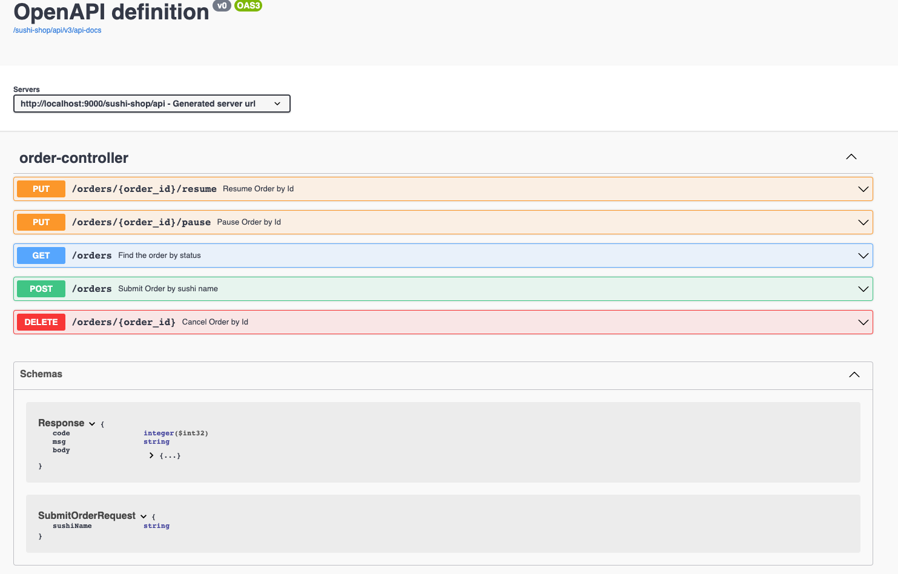

# Sushi Shop

<!-- TOC -->

* [Sushi Shop](#sushi-shop)
    * [Problem Definition](#problem-definition)
    * [Requirements and Execution](#requirements-and-execution)
    * [Design and Implementation](#design-and-implementation)
        * [Assumptions](#assumptions)
    * [Components](#components)
        * [Chef Manager](#chef-manager)
        * [Chef](#chef)
        * [OrderCacheService](#ordercacheservice)
        * [OrderResumeCacheService](#orderresumecacheservice)
        * [Diagram](#diagram)
        * [Test Coverage](#test-coverage)
    * [Demo](#demo)
    * [Out Scope](#out-scope)
    * [Improvements](#improvements)

<!-- TOC -->

## Problem Definition

The challenge is to build a simulated sushi shop server-side program that takes orders from the customers, processes the orders in parallel, shows and updates the order status.

The program should be built using the following configurations/frameworks/tools:

* Java 8
* Spring boot
* H2 database
* Maven/Gradle

## Requirements and Execution

This project is compiling with Java 8 and uses Maven 3.6.3.

## Design and Implementation

### Assumptions

Below are described the assumption taken during the development of this project:

* Field called 'time_spent' was added to the table 'sushi_order' in order to handle the requirement.
* When a given order is cancelled or paused the chef is released and ready to process the next order.
* When a given order is resumed is processed with priority for the next available chef but there is no guarantee that the same chef will resume that order.
* An order is considered ready to be processed only when its status is 'created' in de db, however, existing orders with status 'in-progress' are not revisited until the order is
  resumed.

## Components

Below are described the defined to process the orders in parallel based on the requirements:

### Chef Manager

The Chef Manager is responsible for monitoring periodically if there are any pending orders. The manager asks the chef to review and process an order if any order is available.

### Chef

The Chef is in charged of checking, processing and update the order process in the DB.

### OrderCacheService

This an in memory cache implementation that holds the orders changed to 'paused' or 'cancelled'.
This cache helps the chef to react to any order change without query to a DB improving the performance.

### OrderResumeCacheService

This an in memory stack implementation that holds the resumed orders and It is used by the OrderProcessor to
prioritize that orders

### Diagram

The below digrams shows how the component are organized.


### Test Coverage

The project include a test suite to include unit test and RestAPI test and a sample report generated with IntelLiJ EDA is shown below:


## Demo

The application can be started by running the below command line:

```console
$  mvn clean spring-boot:run
```

By default, the application runs on port '9000' and expose a swagger ui in the url

[swagger-ui](http://localhost:9000/sushi-shop/api/swagger-ui/index.html)


Once an order is submitted is processed according the chef availability, below is shown a sample of logs generated as part of the process.


## Out Scope

This project implement a basic in memory cache mechanises that covers the requirements but this implementation doesn't include any cache expiration.

## Improvements

* Per requirement the DB is initialized by sql script, however, It can be done with libraries such as [Liquibase](https://www.liquibase.org/)
  or [Flyway](https://www.liquibase.org/), , since, these libraries provide some handy feature such as database object versioning, deployment etc.
* The DTO conversion can be done with library called [Mapstruct](https://mapstruct.org/), It helps to reduce the boilerplate code.


